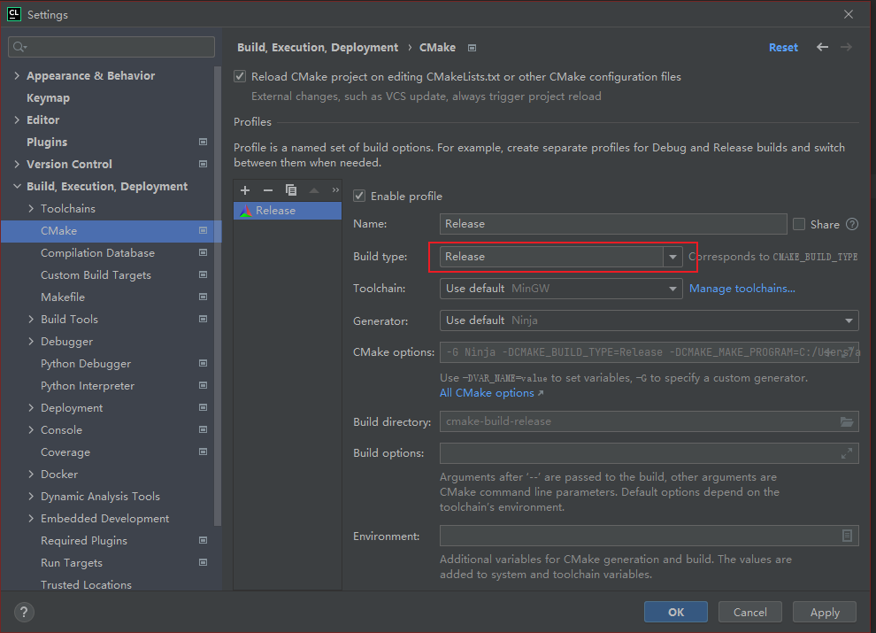

# 学生信息管理系统Demo。基于cmake的qt项目

## 注意事项

1. CMakeLists.text下的cmake路径需要更改为本地的路径

2. clion使用utf-8编码，控制台输出乱码
> 双击shift，输入registry
> 
> 

3. 如果是使用MniGW运行可能会报错
> 提示 xxx Qt5Cored.dll 复制失败，且qt/MinGW/bin下是不存在这个文件的,需要将debug更改为release运行
> 
> 貌似 MSVC 可以正常运行，没有测试过
> 
> 